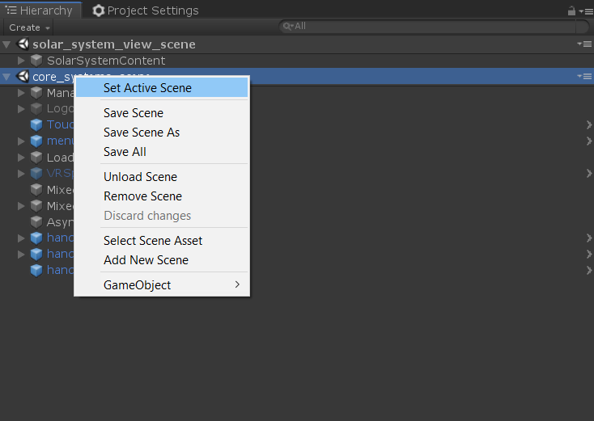
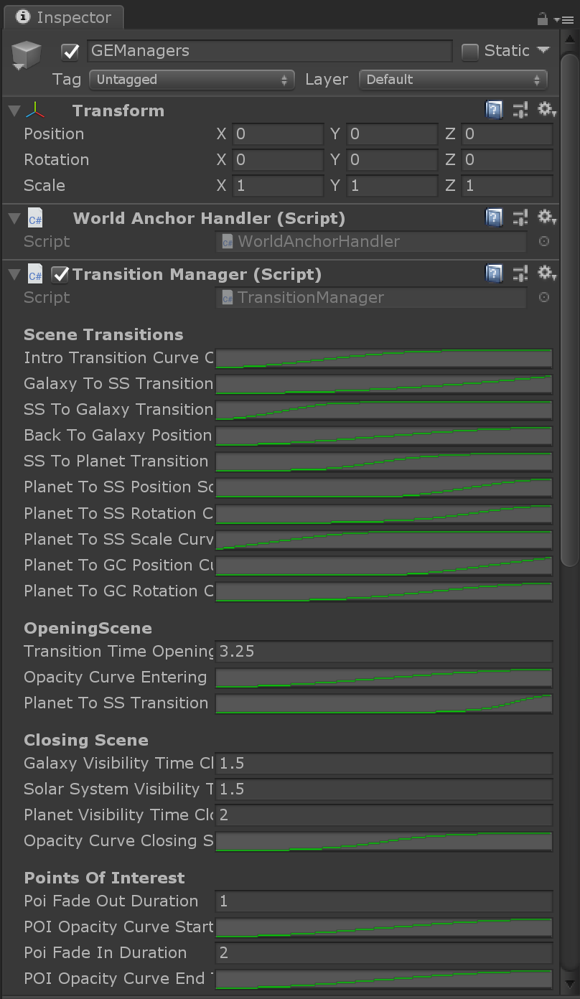

# Application flow

This page contains information about how the application is structured, when scenes are triggered and so on.

## CoreSystems scene

`scenes/core_systems_scene.unity` is a scene that contains most of the global game objects. It contains things like the touch manager, the [menu system](MenuSystem.md) and audio functionality. The core_systems_scene is loaded into all content scenes via `Layers` so that developers and artists can run any scene independently from running the main_scene.

That said, while the CoreSystems is auto loaded, the view scene will only play correctly if the core scene is added as the "Active Scene". The main_scene is the exception to this.

## SceneTransition

Each view in the application (galactic disc, galactic center and solar system) is a scene in scenes/view_scenes. Every scene needs to have a Scene Transition component added to the root entity of the scene. All other game objects need to live under this entity. This is used by the [TransitionManager](##TransitionManager) to move from the current scene to another one.

The component is aware of the size of the scene via the reference to a collider named `EntireSceneCollider`.

It also contains a `SceneFocusCollider` that defines the focus point within the scene for a transition. For example the galactic disc will have the focus collider on the center of the galaxy, the solar system scene has the sun as focus collider. The idea is that the previous and new scene's focus colliders are being transitioned from one into the other.

It also has a reference to `SceneObject` - the entity in the scene that the transform is applied to during a transition. This needs to be a child of the SceneTransition (scene root) object and needs to have an identity transform. All game objects of the scene need to be under this scene object or they won't be moved along during transition.

## TransitionManager

The actual transition is managed through the [GalaxyExplorerManager](##GalaxyExplorerManager) in the CoreScene. [ViewLoader](##ViewLoader) handles (un-)loading these scenes and the `TransitionManager` manages the actual movement from one scene to the other through callbacks from the ViewLoader. This system also handles additional animations that are run between scenes for theatrical effect.

### How the transition manager works

First, components not relevant for the transition are disabled, for example the OrbitUpdater, POIRotation animation, PointOfInterests, Touchscript and so on. All these are components that move the game objects in the scene and they should not move during a transition to a new scene.

The new scene will be scaled to fill the given percentage of a global volume. The global volume is defined in the transform of TransformSource. The specific percentage for the new scene is set in [SceneTransition](##SceneTransition) component (see above, "*Fill Volume Percentage*").

Next up is the initialization of the `ZoomInOutBehaviour` functionality. At this step the properties for the start and end position, rotation and scale are set and the scene objects should not change anything by themselves anymore.

All colliders of the current and the new scene are deactivated so no user interactions are possible during the transition.

Any [POIs](PointsOfInterest.md) in the current scene fade out completely, then the whole scene starts fading out.

The audio transition plays and the new scene is now active and stars fading in, however the alpha for any POIs stay at zero so they aren't visible. Then the actual transition starts via `ZoomInOutSimultaneouslyFlow`. When that transition is complete, the previous scene unloads, the new scene's POIs fade in and the colliders are enabled again.

`ZoomInOut.cs` implements the transition logic to modify the current and new scene to transition from the current scene's focus collider transform into the next scene's focus collider transform. See [SceneTransition](##SceneTransition) for details on where to set focus colliders.

When transitioning keep in mind that scenes need to be rotated and scaled around the focus objects as pivots.

## ViewLoader

`ViewLoader` lives inside CoreSystems scene and manages the loading & unloading of scenes used throughout the app. [TransitionManager](##TransitionManager) calls this in order to load and unload scenes.

All script hook up on ViewLoader's callbacks in order to know when a new scene is about to be loaded and when that has been completed.

ViewLoader also keeps the trail of scenes in a stack in order to know to which scene to go back to (used by the "back" button in the [menu](MenuSystem.md)). Scenes during the introduction flow should not go into this stack as the user is not supposed to go back to the introduction flow.

## GalaxyExplorerManager

This is one of the main components of the application. It's attached to the Managers/GEManagers gameobject in the CoreScene. Its execution order is set to execute before the Unity's default execution order starts.

GalaxyExplorerManager decides on which platform the application is currently running (`PlatformId`) and holds properties that are different per platform. It also holds references to many other managers of the scene in order for components to access them through the GalaxyExplorerManager.

The platform detection happens as part of GalaxyExplorerManager's Awake function. When running as a UWP application, the component first checks if it is running on a HoloLens 2 by querrying Windows' [EasClientDeviceInformation class](https://docs.microsoft.com/en-us/uwp/api/Windows.Security.ExchangeActiveSyncProvisioning.EasClientDeviceInformation) to get local device information.

If this is not the case, it will continue with a check for HoloLens (gen1) and VR through Unity's XRDevice class. If this returns true, the script further distinguishes between HoloLens (gen1) and VR by checking if the display is opaque or not through Unity's HolographicSettings class.

If none of the above cases is found to be true, the platform will be set to desktop.

# TransformHandler

Every scene should spawn around the placement object the user places at the start of the experience. In order to keep consecutive scenes in same position, rotation and scale, every scene needs to have a TransformHandle with the matching id of TransformSource (*Transform Source Id*). The position, rotation and scaling properties are then synced through the transform in TransformHandle. This way, all scenes, have the same transform values.

