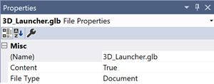

# Building & running the application

## Running in Unity

Note that by default when you download / clone this repository and open it in Unity, it will open a new scene. Navigate to the *Assets/scenes* folder and double-click main_scene to set up the editor properly. After that, you can hit the play button to succesfully start the experience.

## Building Galaxy Explorer

In the Unity editor, choose *File > Build Settings* to bring up the build settings window. All of the scenes in the *Scenes In Build* section should be checked.

Choose *Universal Windows Platform* as the platform. On the right side, choose *Any device* as the target device, *XAML* as the build type, and *10.0.18361.0* as the target SDK version.

You can now build the project.

After the build completes successfully, an explorer window will pop up. Navigate into the build folder you created and double-click the generated *GalaxyExplorer.sln* file in its root to launch the solution in Visual Studio.

In Visual Studio, set the configuration to *Release* for faster builds (doesn't use .NET Native) or *Master* to build the type of package the Microsoft Store needs (uses .NET Native).

### Building for HoloLens (1st gen)

In *File > Build Settings*:

Architecture should be set to **x86**.

### Building for HoloLens 2

In *File > Build Settings*:

Architecture should be set to **ARM**.

### Building for Windows Mixed Reality headsets

In *File > Build Settings*:

Architecture should be set to **x64**.

### Building for Windows Desktop

In *File > Build Settings*:

Architecture should be set to **x64** or **x86**.

It's now possible to deploy to the emulator, a remote device, or create a Microsoft Store package to deploy at a later time.

### Implementing a 3D app launcher icon

When you create the project in Visual Studio, it creates the default tile that displays Galaxy Explorer's name and logo. To replace this 2D representation with a 3D galaxy model edit the app manifest of your application to include the “MixedRealityModel” element as part of your default tile definition. To revert to the 2D launcher just remove the MixedRealityModel definition from the manifest:
llowed by selecting the XML editor.
At the top of the manifest, add the uap5 schema and include it as an ignorable namespace:
First, locate the app package manifest in your current project. By default, the manifest will be named Package.appxmanifest. If you're using Visual Studio, then right-click the manifest in your solution viewer and select "Open with..." fo

      <Package xmlns:mp="http://schemas.microsoft.com/appx/2014/phone/manifest" 
              xmlns:uap="http://schemas.microsoft.com/appx/manifest/uap/windows10" 
              xmlns:uap2="http://schemas.microsoft.com/appx/manifest/uap/windows10/2" 
              xmlns:uap5="http://schemas.microsoft.com/appx/manifest/uap/windows10/5"
              IgnorableNamespaces="uap uap2 uap5 mp"
              xmlns="http://schemas.microsoft.com/appx/manifest/foundation/windows10">
         
Next specify the "MixedRealityModel" in the default tile for your application as in the sample code below (this part might differ depending on what you want to include, exclude or customize in your build):

      <Applications>
          <Application Id="App"
            Executable="$targetnametoken$.exe"
            EntryPoint="ExampleApp.App">
            <uap:VisualElements
              DisplayName="ExampleApp"
              Square150x150Logo="Assets\Logo.png"
              Square44x44Logo="Assets\SmallLogo.png"
              Description="ExampleApp"
              BackgroundColor="#464646">
              <uap:DefaultTile Wide310x150Logo="Assets\WideLogo.png" >
                <uap5:MixedRealityModel Path="Assets\My3DTile.glb" />
              </uap:DefaultTile>
              <uap:SplashScreen Image="Assets\SplashScreen.png" />
            </uap:VisualElements>
          </Application>
      </Applications>

The 3D galaxy model '3DTile.glb' is located in the app's Assets folder.

The MixedRealityModel elements accepts a file path pointing to a 3D asset stored in your app package. Generally you can implement your own custom 3D models as you like, although currently only 3D models delivered using the .glb file format and authored against the Windows Mixed Reality 3D asset authoring instructions are supported. Assets must be stored in the app package and animation is not currently supported. If the “Path” parameter is left blank Windows will show the 2D slate instead of the 3D launcher.
Note: the .glb asset must be marked as "Content" in your build settings before building and running your app:

For general instructions on implementing 3D launcher icons, also refer to the [Mixed Reality online documentation](https://docs.microsoft.com/en-us/windows/mixed-reality/implementing-3d-app-launchers)

# See also

- [Unity Manual: Universal Windows Platform](https://docs.unity3d.com/Manual/windowsstore-il2cpp.html)
