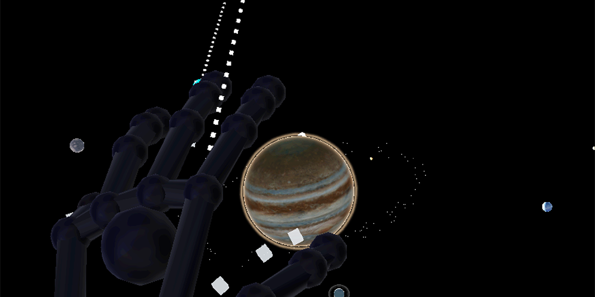
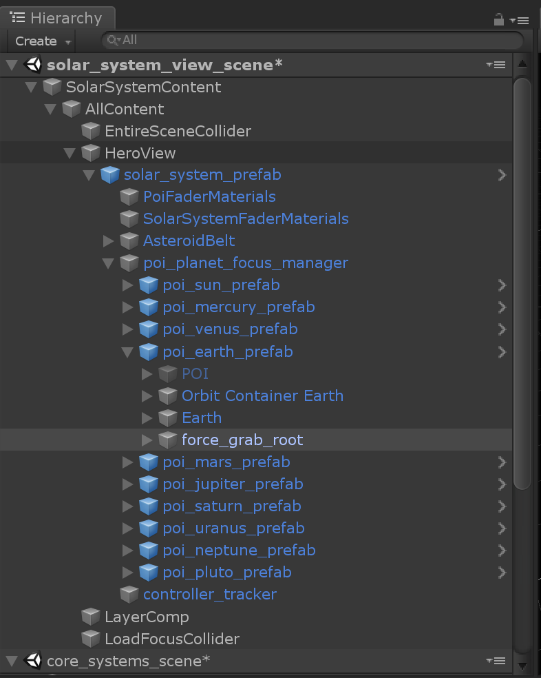
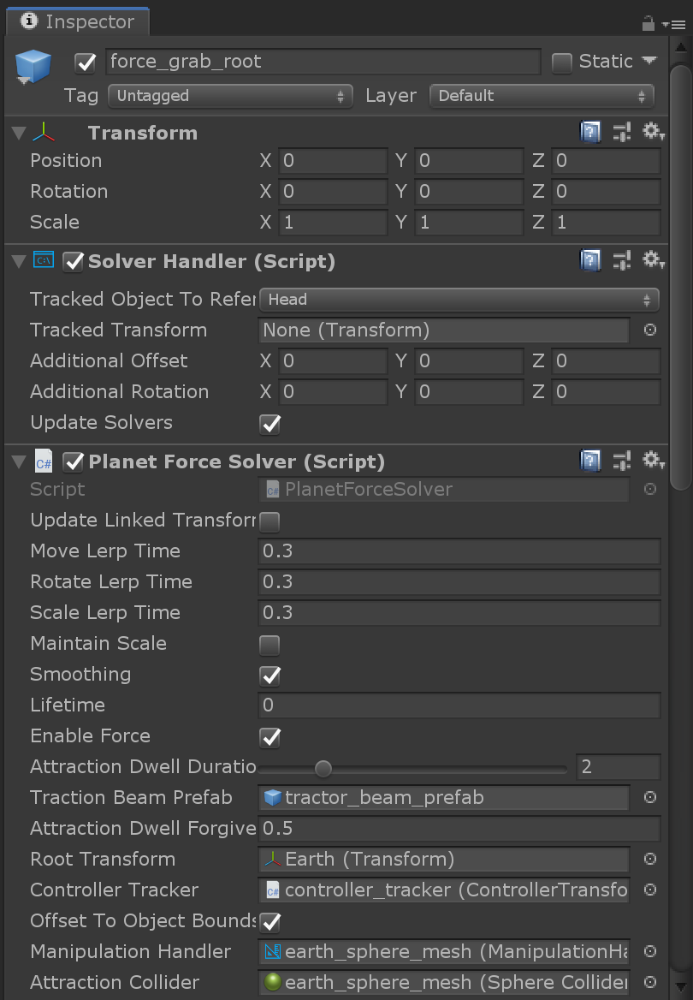
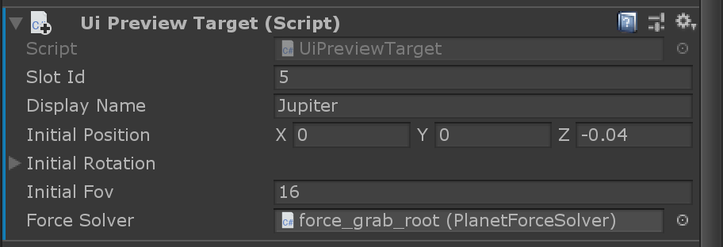

# Force grab interaction

Force grab will pull the targeted object to the user after a specified amount of time. To achieve this, force grab combines a far ray with a progress bar. It's a convenient way to pull objects closer without having to learn pinch or air tap gestures. You can read about the [concept and prototyping](https://docs.microsoft.com/windows/mixed-reality/galaxy-explorer-update) of the force grab on Microsoft Docs.

## SolverHandler

Force grab is based on [Solvers](https://microsoft.github.io/MixedRealityToolkit-Unity/Documentation/README_Solver.html) in MRTK v2. The object should be pulled towards the user's hand and follow it as they move around. Solvers can be attached to a controller and to an object to make the object *tag-along* with the controller.

Each planet has a *force_grab_root* that contains the `SolverHandler` component.

## PlanetForceSolver

Attached to the same game object is the `PlanetForceSolver` component, which takes care of the scaling, playing and stopping audio, as well as showing and hiding the moons (see image below).

**RootTransform**

This variable needs to be set to the transform of the object that should be affected by the pull.

**AttractionDwellDuration**

This is the time in seconds from the moment the far ray touches the object until the object is being pulled towards the user.

**AttractionDwellForgiveness**

Since the planets are moving and can be hard to target, there is a grace period (`AttractionDwellForgiveness`) where the user can "miss" the targeted object while the attraction counter still continues.

**TractionBeamPrefab**

The `TractionBeamPrefab` variable contains a reference to the prefab implementing the "lasso" effect that reaches out from the controller to the targeted object. 

## Grabbing objects

Grabbing objects is based on the standard one- and two-handed [manipulation in MRTK v2](https://microsoft.github.io/MixedRealityToolkit-Unity/Documentation/README_ManipulationHandler.html).

## Force grab behavior on desktop

On desktop, selecting planets and solar objects works differently. Instead of selecting planets in their solar system orbits, the users can select them from an overview menu.

Each object in the solar system has an assigned `UIPreviewTarget` component that will add it to the overview menu.

## Moons

Note that some planets have moons, for example Earth, Mars and Jupiter. The moons are not visible when the planets are orbiting the sun. The `PlanetForceSolver` component shows them when a planet is in focus mode and hides them again when the planet loses focus.

## See also
- [MRTK v2 documentation: Solvers](https://microsoft.github.io/MixedRealityToolkit-Unity/Documentation/README_Solver.html)
- [MRTK v2 documentation: ManipulationHandler](https://microsoft.github.io/MixedRealityToolkit-Unity/Documentation/README_ManipulationHandler.html)
- [Concepting and prototyping the force grab](https://docs.microsoft.com/windows/mixed-reality/galaxy-explorer-update)