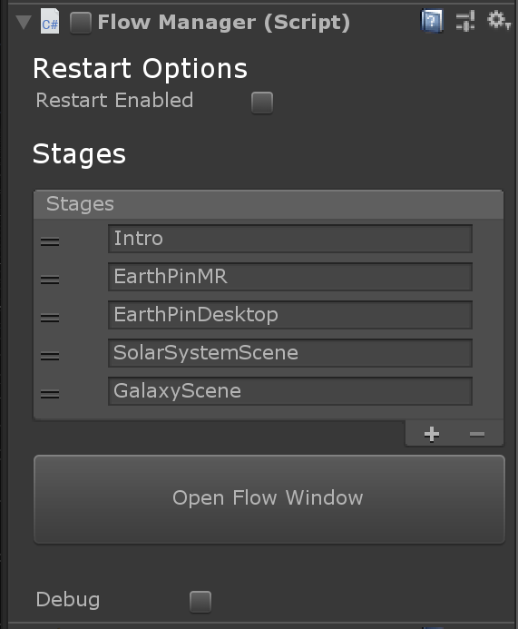
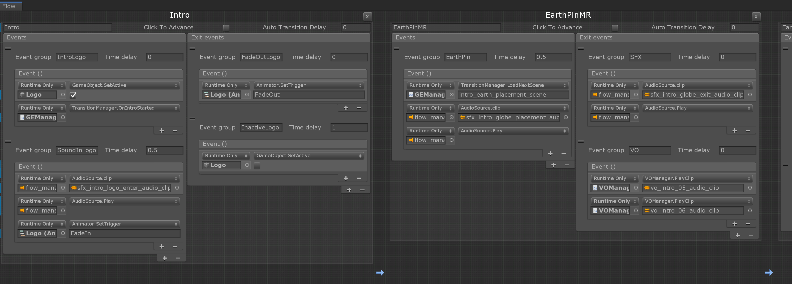

# Intro system

## IntroFlow

The introduction sequence with transitions seen at the start of Galaxy Explorer is implemented through the `IntroFlow` component, which can be found attached to the *IntroFlow* game object in the main scene.

The IntroFlow component in turn is dependent on the `FlowManager` component.

## FlowManager

The flow manager is a sequencing tool intended to easily drive a simple sequence of interactive (or non-interactive) events. It can be used via its single C# script, or in prefab form. It's dependent on the MRTK for input events.

The component can be found attached to the *flow_manager_prefab* game object, child of the *Managers* game object in the core systems scene.

### Stages

The flow manager manages transitions between different application stages. In the component's inspector window the 5 stages that are currently part of Galaxy Explorer's introduction are visible:  *Intro*, *EarthPinMR*, *EarthPinDesktop*, *SolarSystemScene*, *GalaxyScene*.

### Editing the intro flow

`FlowManager` has a **custom in-editor UI** which allows you to edit the introduction flow. In the Unity inspector window of the `FlowManager` component, click the **Open Flow Window** button to open up the custom in-editor window (see image above).

In this window more details are visible about the intro stages and their transitions. When this 'flow' has been completed and the final *GalaxyScene* stage has been reached, control over transitions is taken over by other parts of the code which handle the more complex transition logic of the rest of the application.

To edit the intro stages, scroll to the utmost right side of the list of the flow manager window and press the **+ new stage** button. If you want the remove a stage, simply press the **x** in the top right corner of the stage you want to remove.

For each stage you can add **Event groups**. These event groups contain both **Events** and **Exit events** that can be hooked up to the appropriate functionality following the regular work flow for Unity events.

### Exposed methods

To control non-automatic transitions, FlowManager exposes 2 methods.

- `AdvanceStage()` can be called to transition to the next stage.
- `JumpToStage(int targetStage)` can be called to transition to a specified stage.

### Public variables

The flow manager also exposes a set of public variables. 

**int m_currentStage**

The currently active stage.

**bool m_restartEnabled**

A bool indicating if the flow manager needs 'restart' by looping back to an earlier stage after the final stage in the flow has been completed.

**int m_loopBackStage**

The stage to loop back to when restarting the flow.

**string m_currentStageName**

The name of the currently active stage.

**float m_fastestTapTime**

A certain amount of time that needs to pass after the start of a stage for the user to initiate a transition to a next stage by tapping.  

**FlowStage[] m_stages**

A list containing all of the stages.

### Events

Additionally, the FlowManager provides the following events:

- *OnAutoTransition*: Fired when an automatic transition is started.
- *OnManualTransition*: Fired when a manual transition is started.
- *OnStageTransition*: Fired when a new stage is entered.
- *OnLoopbackTransition*: Fired when looping back to the start of the current stage.

### Debug

To get access to the above mentioned public variables through the `FlowManager` component in the Unity editor, toggle on the `Debug` setting at the bottom of the component in the Unity inspector view.

## FlowStage

A Flowstage defines a discrete phase of the app flow. The code for this can be found in *FlowStage.cs*.

*Events*: Array of events that are fired upon entry and during a stage.

*ExitEvents*: Array of events that are fired upon transition to the next stage.

## DelayedEvents

A wrapped UnityEvent that can trigger after a delay. The code for this can also be found in *FlowStage.cs*.