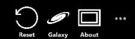
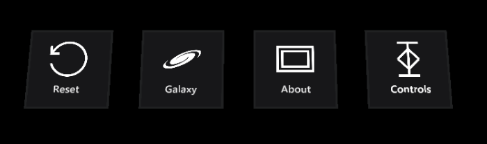

# Menu System

The menu system allows the user to navigate within the application. Since the application is running on platforms with different input paradigms, it needs to adapt the presentation and functionality of the menu according to the platform it currently runs on.

## Global Menu Manager

This script contains the shared functionality between the menus for the different platforms. It is attached to the `menu_managers` game object in the scene. It manages the overall menu state and activates / disables the menus according to the correct platform. It also checks if the reset and back button need to be set to visible.

Buttons are positioned dynamically as contextual buttons appear and disappear, but since each of the menus currently has differing logic to decide how, this is for now implemented in the managers belonging to the specific menu types.

## Desktop Menu

This menu is used when running the application on Windows 10 desktop. The functionality specific to desktop mode is managed by the `DesktopManager`, which is attached to `menu_managers` in the scene.

The desktop menu uses simple native Unity button components and a canvas. The game object containing the canvas needs to also contain the additional `CanvasUtility` script to be able to tap into the MRTKv2 input system.

## GGV Menu (HoloLens 1st gen and VR with controllers)

On HoloLens (1st gen) and VR, the menu will float in front of the user. In terms of functionality, these platforms are managed by the `GGVMenuManager`, which is  attached to `menu_managers` object in the scene. This menu has two extra buttons to raise and lower the floating menu.

This menu uses the MRTKv2 `PressableButton` prefab to create the buttons and handle their functionality.

## Hand Menu (HoloLens 2)

This menu is used on platforms that support articulated hands (like HoloLens 2). Functionality specific to these platforms is managed by `HandMenuManager`, again attached to `menu_managers` object.

The hand menu itself exists outside the main hierarchy of the scene, since the menu is following the hands of the user - it is the only menu type that continuously moves around according to input.

The menu is shown when the user is holding up a hand, palm up. This is implemented through the `HandMenu` script, attached to the hand menu prefabs. The orientation of the palm joint is used to calculate the angle between the user's palm and the camera forward angle (the user's head).

The hand menu uses [MRTK solvers](https://github.com/Microsoft/MixedRealityToolkit-Unity/blob/mrtk_development/Documentation/README_Solver.md) to resolve if any hands are currently tracked and what their current position and rotation is. Since the position of the menu depends on the hand it's attached to (left or right), it was decided to create a seperate prefab for each hand.

This menu also uses the MRTKv2 `PressableButton` prefab to create the buttons and handle their functionality.

## How To Add New Buttons

How to add new buttons depends on whether they are meant to be contextual or global (always present).

### Global Buttons

Global buttons are always visible when the menu is visible and have a fixed position. In the desktop and ggv menus they are the utmost right buttons. In the hand menu they are the bottom ones.

### Contextual Buttons

Contextual buttons only show when certain conditions are met. For desktop and ggv menus, they are added on the left of the global buttons. In the hand menu they are added above the global buttons.

The global button positions remain the same. The contextual buttons have their positions dynamically changed according to how many other contextual buttons are shown at any given moment. For the desktop and HoloLens (1st gen)/VR menus, the code for this resides in the managers belonging to the specific menu types. For the hand menu, this is done in the HandMenu script.