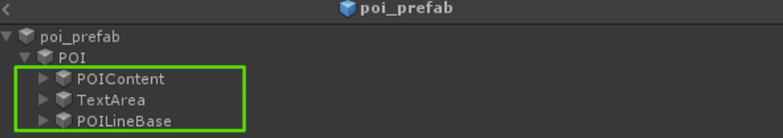
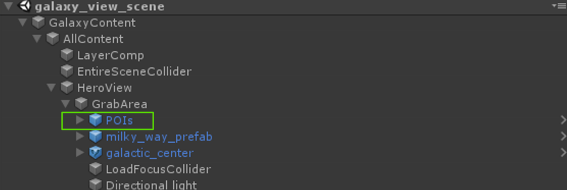
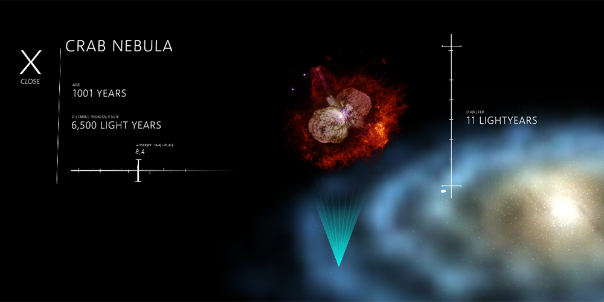
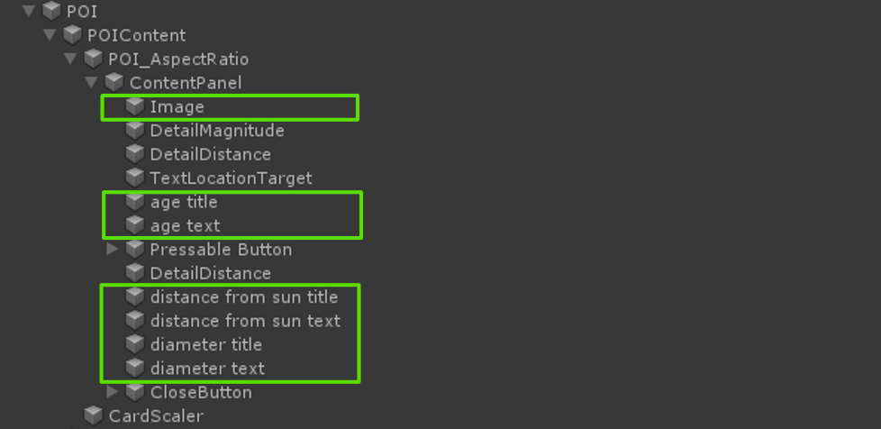
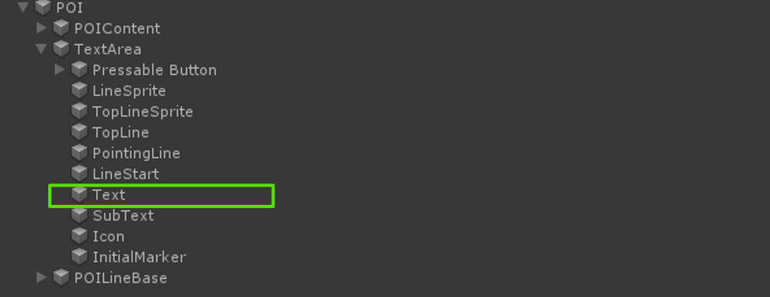
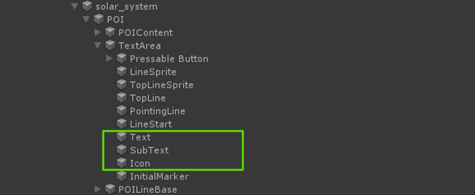

# Points of interest

Points of interest (POI) enable the user to navigate to deeper levels of information within the application.

## Types of POIs

There are 2 types of POI prefabs. Both types share the same content and hierarchy, but differ in what specific components are en-/disabled according to their required functionality in the scene.

- *poi_prefab*: The base prefab, used for a poi that opens up a content window inside the galaxy view on selection.

- *poi_prefab_large*: A variant on *poi_prefab*, used for a poi that transitions to another scene.

## POI prefab components

Every POI consists of 3 subparts:

- *POIContent*: This contains the content for the POI pop-up windows (only relevant for the *prefab_poi*, not for the large variant).

- *TextArea*: This contains the poi text and the interactive functionality, as well as the POI intermittent highlight. The [PressableButton](https://microsoft.github.io/MixedRealityToolkit-Unity/Documentation/README_Button.html) prefab already handles cross-platform input (like WMR controllers, articulated hands and gaze-gesture-voice interactions).

- *POILineBase*: This contains the location on the galactic mesh and the line connecting the POI

*Note:* At the time of development the mouse pointer implementation in MRTK v2 was not working as intended. As a result the POIs use a component called `MouseInputEventRouter` as a temporary workaround.  These issues should be [fixed](https://github.com/microsoft/MixedRealityToolkit-Unity/pull/4101) as part of Release Candidate 2 (RC2) of the MRTK v2.

## Components

- `POIBehavior`: The component that contains the raycasting and fading behavior of the POIs.

- `Card POI`: Component used to add the content for the POI pop-up window.

- `Planet POI`: Component used to add the scene to which to transition to.

- `PointOfInterest`: Base class that handles selection and sounds for POI selection. It also controls POI movements in the galaxy and data about the location on the galactic mesh.

## How to add new POIs to the galaxy view

The basic scene to work on POIs is the *galaxy_view_scene*, which can be found under *Assets > scenes > view_scenes*.

To create a new point of interest, simply add an instance of the relevant prefab (*poi_prefab* or *poi_prefab_large*) to the point of interest hierarchy in the scene. Where exactly in the hierarchy depends on whether you want the POI to rotate with the galaxy or not (For example, the POI for the galactic center lives outside of the POI hierarchy since it needs to stay stationary in the scene).

Subsequently, the text, visuals and functionality can be edited to fit the new point of interest.
After the prefab instance is appropriately named and added to the scene, there are some values that need to be changed on the prefab, depending on the type.

### Adding content POIs

The standard *poi_prefab* is used for a POI that opens up a content window inside the galaxy view on selection.

	

On *POI > POI_Content > POI_AspectRatio > ContentPanel*, change the appropriate values on the children named *Image*, *age title*, *age text*, *distance from sun title*, *distance from sun text*, *diameter title*, and *diameter text*.

	
	
On the child called *Text* (*POI > TextArea > Text*), change the text that will appear on the POI in the galaxy view.
	
	
	
Add a voice over audio clip for the POI through `CardPOI` component's `CardAudio` member variable (attached to the POI child).

	

### Adding link POIs

On the child called *Text*, change the text in the `TextMeshPro` component to the text that should appear on the POI in the galaxy view. Additionally the values on *SubText* and *Icon* need to be changed for the large POI.
	
	

For the large POIs, you will need to create a new scene to transition to and link the scene in the `PlanetPOI` component attached to the *POI* game object in the *poi_prefab_large* hierarchy.

## See also

- [MRTK v2 documentation: Pressable button](https://microsoft.github.io/MixedRealityToolkit-Unity/Documentation/README_Button.html)
- [MRTK v2 documentation: Pointers](https://github.com/Microsoft/MixedRealityToolkit-Unity/blob/mrtk_development/Documentation/README_Pointers.md)