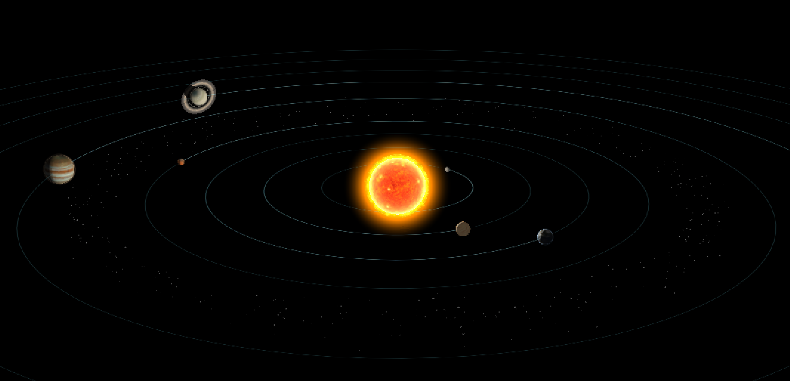
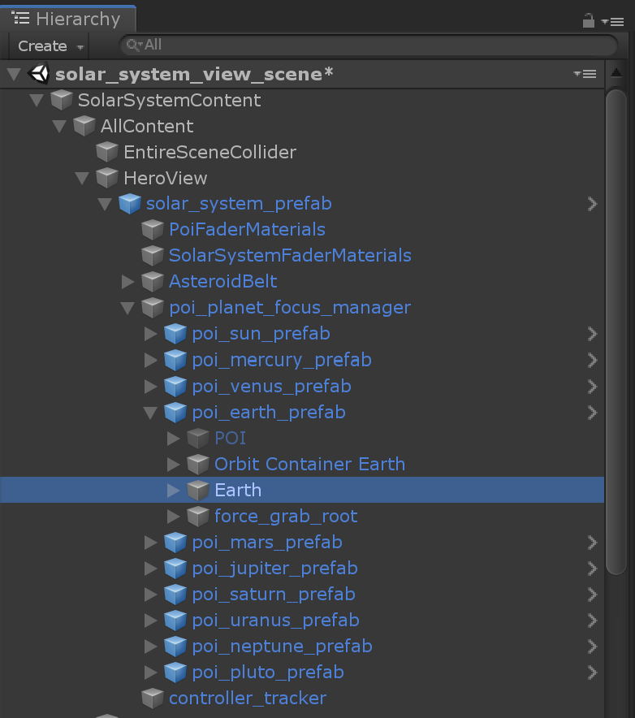
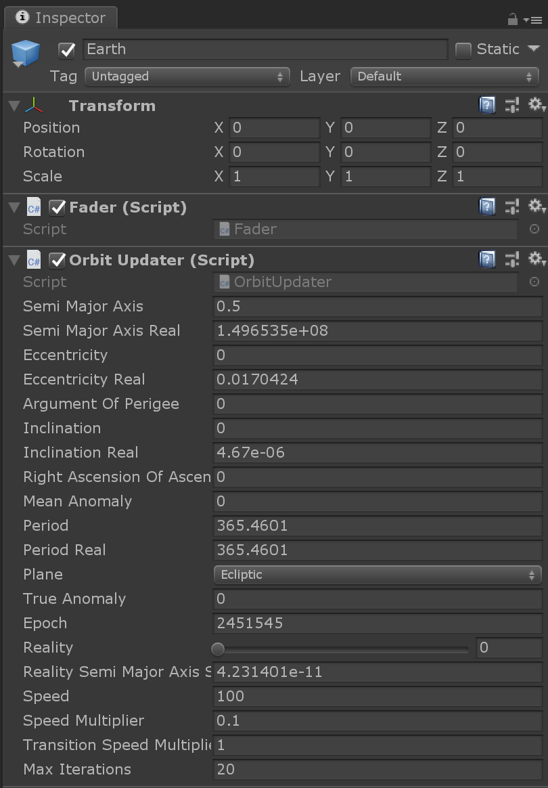
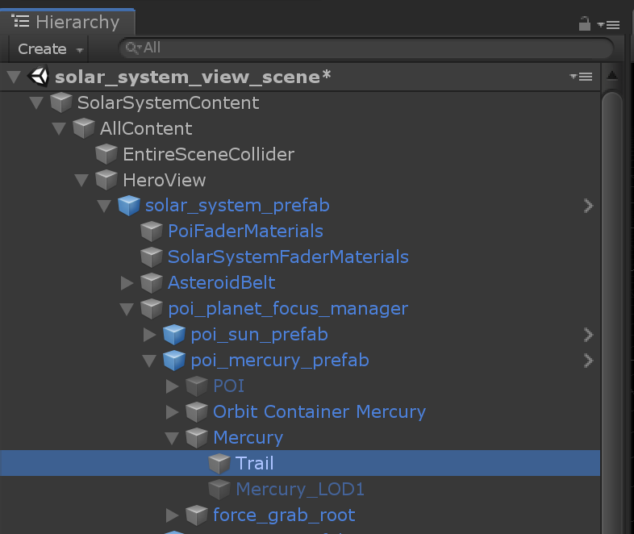
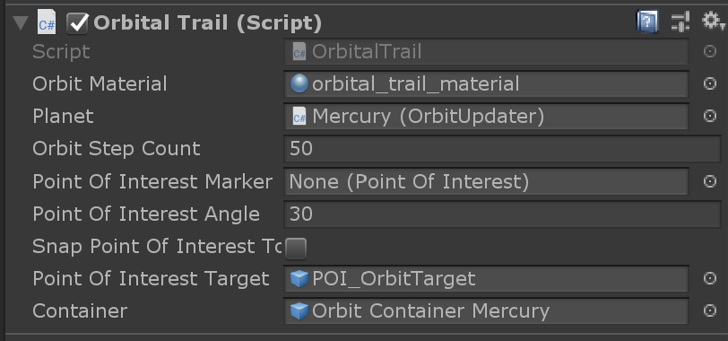
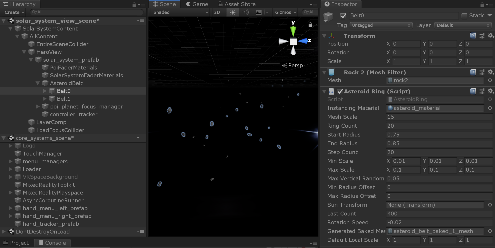

# Solar system

## Realistic mode vs. schematic mode

TBD?

## Planets

Each planet is based on a planet POI in the hierarchy of the solar system. Note that although not actually a planet, the sun is also a planet POI object.

Each planet has specific properties like their distance from the sun and the speed around it, their size, their axial tilt and so on. All those properties can be set for each individual planet in the scene.

## Orbital trails

The orbital trails are screen space lines, expanded by a geometry shader, which are attached to the planets.

Each vertex has 2 positions: one for the real scale view and one for the schematic view. The vertex shader then interpolates between those 2 positions to compute
the final position according the a "reality scale" that moves between 0 and 1 and then passes the final position to a geometry shader that generates correctly triangulated lines in screen space.

This makes the orbits have a fixed width on screen no matter what scale the solar system is being viewed at.

## Asteroid belt

The asteroid belt is generated based on defined properties. For every "ring" 240 asteroids will be placed within the corridor defined by the start and end radius, going around the solar system with a random offset each.

There are actually 2 asteroid belts at the same location, but rotating with different speeds around the sun.

The actual asteroids are all the same model: `asteroid_model.fbx`

## Planet Earth

Planet Earth has some special features. One is that there are night lights illuminating the dark side of the planet, based on NASA photographs. The lights are in the alpha channel of the Albedo texture of the planet and are gamma corrected in order to have a realistic looking light transition from the night side to the day side.  

Note: You might notice that there are lights in the middle of Australia - these are actually wildfires that can be seen from space.

## Planet Saturn

The planets do not use dynamic shadows, since most of them do not have other objects occluding them. One thing that is disregarded are moons crossing in front of the planet (essentially solar eclipses). However the application does use dynamic lighting for Saturn. The ring shadow pattern plays a big part of the aesthetic look of the planet, so it uses analytic shadows.

The logic is to project a sphere on a plane perpendicular to the direction to the sun (which is  approximated as a directional light) and check if the resulting pixel is inside of the shadow or not.

For the shadow of the planet on the rings, the world space position of the pixel on the ring is compared to the radius of the planet when projected on the plane that contains the pixel.

For the shadow of the rings of the planet, the world space position of the pixel is projected on the planet into the rings plane, and the distance to the center of the planet is compared to the distance to the inner ring radius and outer ring radius. This returns a value between 0 and 1, which is then used to sample a shadow texture.