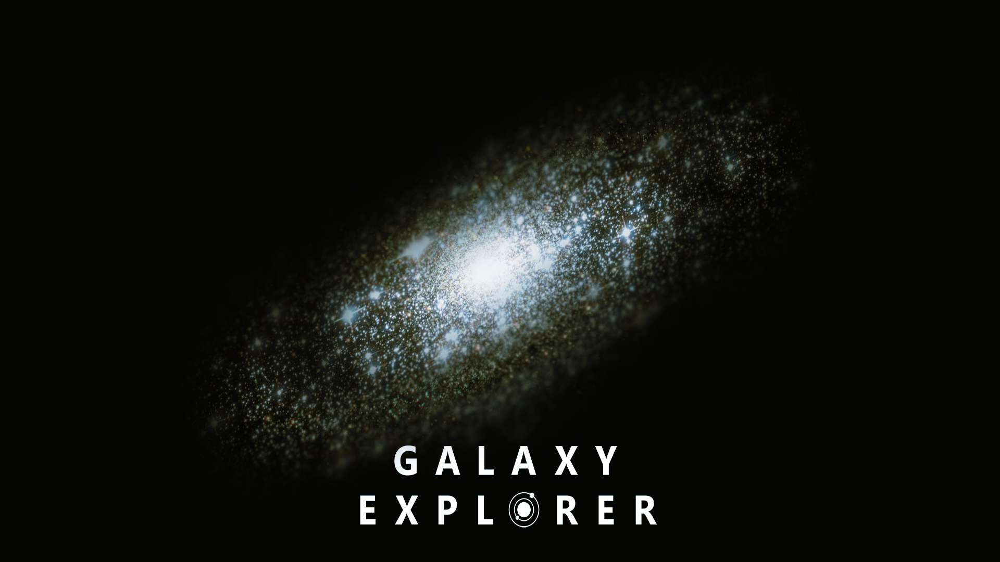
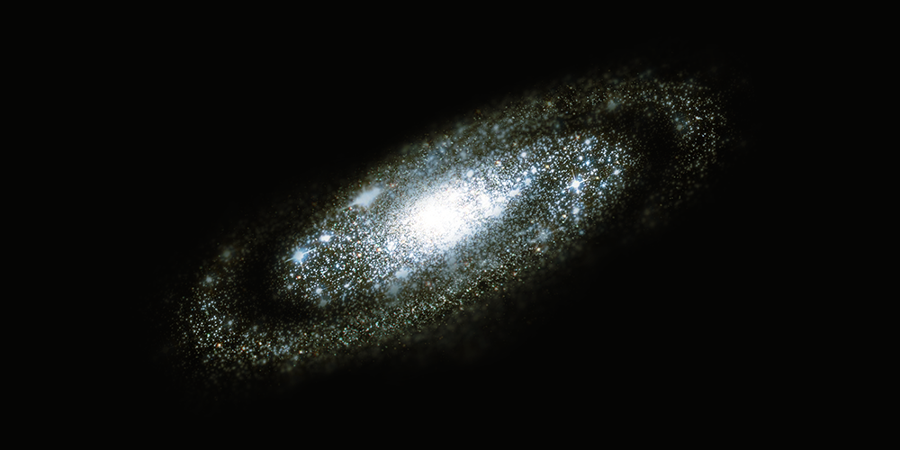
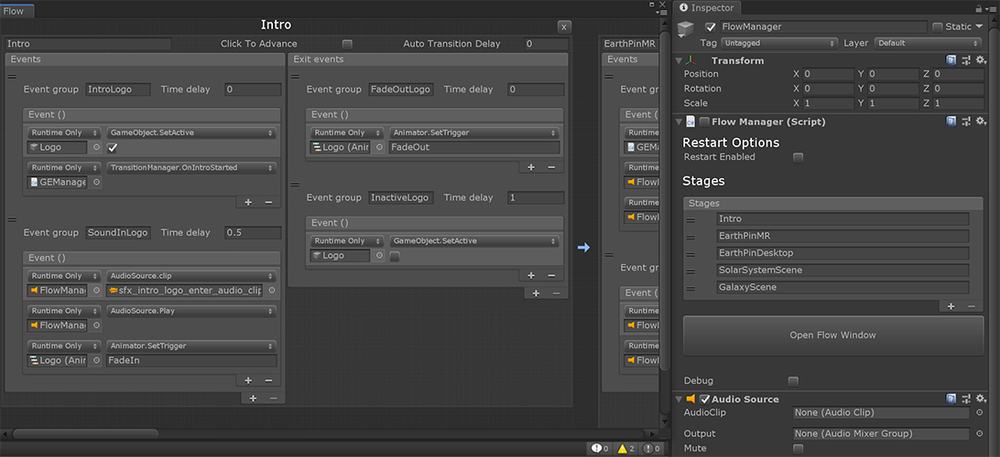
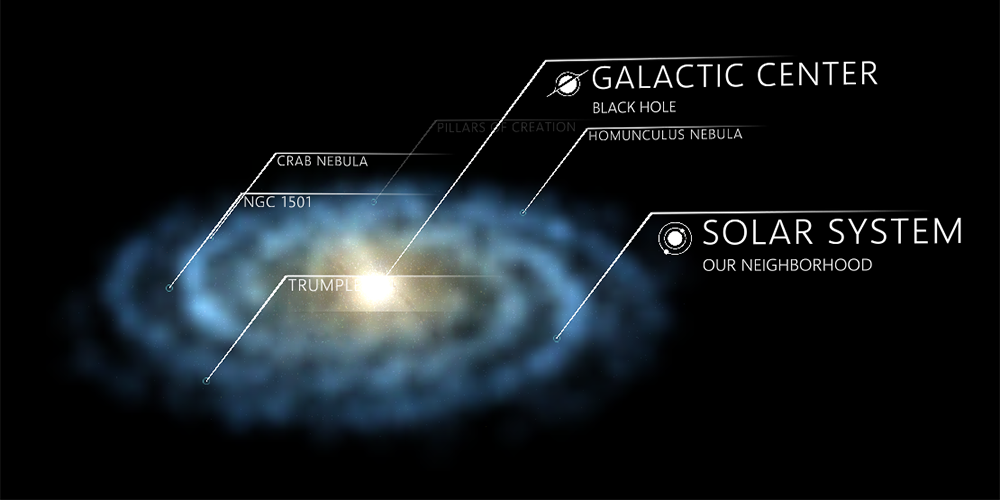
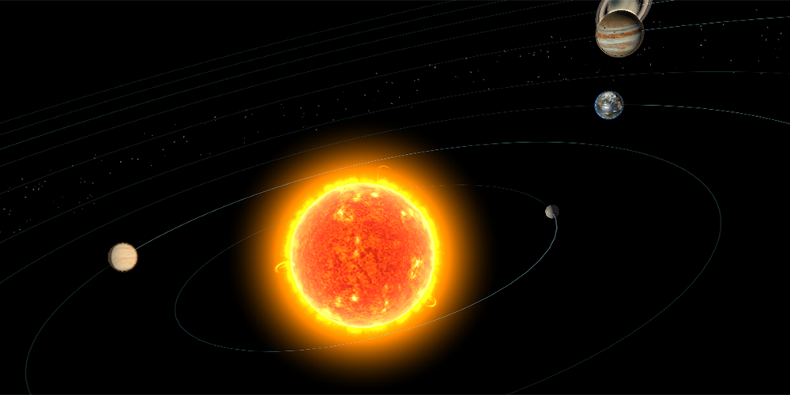
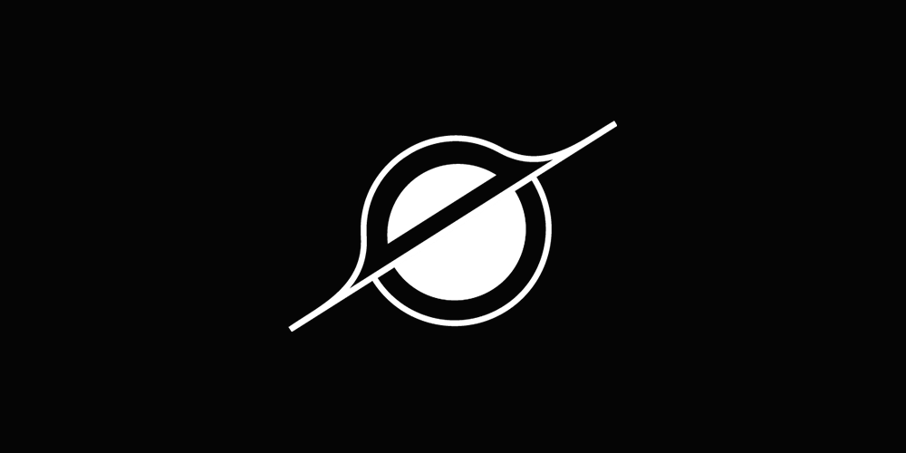
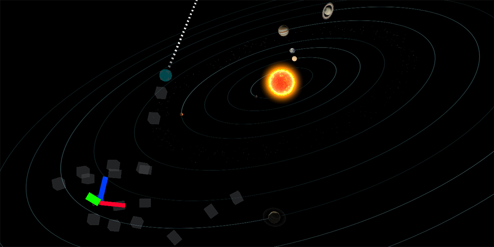
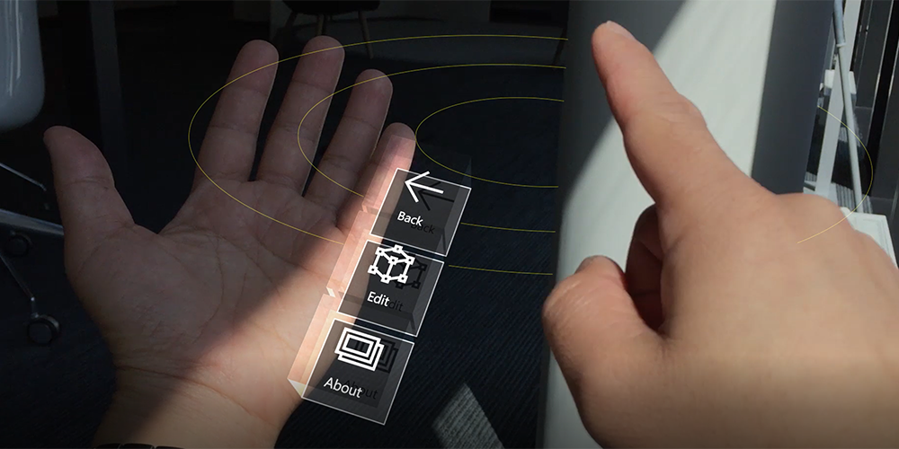

# Galaxy Explorer

Galaxy Explorer is an open-source Windows Mixed Reality application that was originally developed in March 2016 as part of the [HoloLens 'Share Your Idea' campaign](https://blogs.windows.com/buildingapps/2015/12/01/announcing-the-microsoft-hololens-share-your-idea-campaign/) where the community submitted and voted on ideas. Since then Galaxy Explorer has been constantly updated with new features, also adding new platforms in the process.

This project has adopted the [Microsoft Open Source Code of Conduct](https://opensource.microsoft.com/codeofconduct/). For more information see the [Code of Conduct FAQ](https://opensource.microsoft.com/codeofconduct/faq/) or contact [opencode@microsoft.com](mailto:opencode@microsoft.com) with any additional questions or comments.

This project has also adopted the MRTK approach to [contributing](https://github.com/microsoft/MixedRealityToolkit-Unity/blob/mrtk_release/Documentation/Contributing/CONTRIBUTING.md) and [documenting](https://github.com/microsoft/MixedRealityToolkit-Unity/blob/mrtk_release/Documentation/Contributing/DocumentationGuide.md).

## Supported platforms

The following platforms are supported by this project:

- Windows 10 Desktop
- Windows Mixed Reality Headsets (VR)
- HoloLens (1st gen)
- HoloLens 2

## Software versions

The different versions that the current project is developed on:

- [Unity](https://unity.com/) version 2018.3.8f1+
- [MixedRealityToolkit-Unity](https://github.com/microsoft/MixedRealityToolkit-Unity), version 2.0.0.rc1
- [Visual Studio 2017](https://visualstudio.microsoft.com/), 15.9+
- [Windows SDK 18362+](https://developer.microsoft.com/en-US/windows/downloads/windows-10-sdk)

Download all of the developer tools from the [Microsoft Developer Website](https://developer.microsoft.com/en-us/mixed-reality).

## Application building blocks

|  [Building & running the application](Documentation/BuildingGalaxyExplorer.md) |  [Application flow](Documentation/ApplicationFlow.md) |  [Audio system](Documentation/AudioSystem.md) |
|:--- | :--- | :--- |
| How to run the application in the Unity editor as well as how to build the application for the different target platforms. | Information how the application is structured, when scenes are triggered and so on. | Information on the audio system, how to include and trigger sound effects as well as music. |
|   [Galaxy](Documentation/Galaxy.md)|  [Solar system](Documentation/SolarSystem.md) |  [Galactic center](Documentation/GalacticCenter.md) |
| Explains how the galaxy is created and rendered. | How the solar system is created and how the elements work. | Explains the center of the galaxy scene and its elements. |
|   [Force pull interaction](Documentation/ForcePullInteraction.md)|  [Points of Interest](Documentation/HandMenu.md) |  [Hand Menu](Documentation/HandMenu.md) |
| Details on the "force pull" interaction, how it works and how it applies to elements. | How the points of interest work - the labels as well as the "content cards". | More information about the hand menu, its elements and functionality. |

